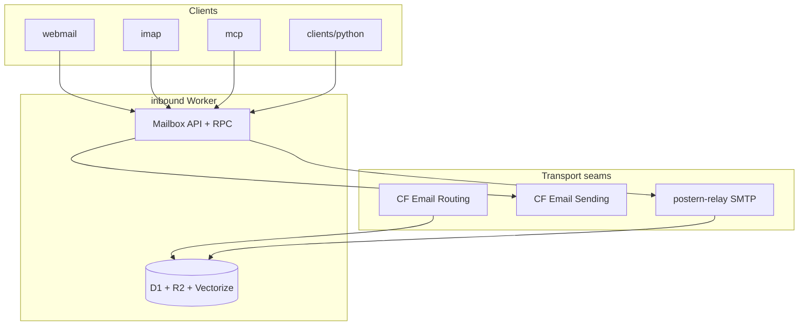

# postern

[](https://github.com/skyphusion-labs/postern/releases)
[](https://github.com/skyphusion-labs/postern/actions/workflows/ci.yml)
[](https://www.npmjs.com/package/@skyphusion/postern-mcp)
[](https://pypi.org/project/postern-client/)

Email, for humans and agents. Postern is a self-hostable mailbox on Cloudflare:
it sends and receives mail, stores every message in a searchable store, and
exposes one structured API that agents and human clients (IMAP/webmail) both
speak. Cloudflare Email is the default transport on each seam, never a hard
dependency.

From a fresh clone, with only your own domain, you can deploy it, send a
message, and receive + read it back. See **[DEPLOY.md](DEPLOY.md)** for the
clean-install quickstart and **[inbound/smoke.mjs](inbound/smoke.mjs)** for the
scripted v1.0 acceptance smoke (issue #25).

Six surfaces in one repo (one store, one API):

| Path | Role |
|------|------|
| **`inbound/`** | Core Cloudflare Worker: ingest, store (D1 + R2 + Vectorize), mailbox API, send |
| **`relay/`** | Optional Go SMTP daemon: loopback ingest, submission 587/465, BYO dispatch |
| **`mcp/`** | MCP server for agents ([`@skyphusion/postern-mcp`](https://www.npmjs.com/package/@skyphusion/postern-mcp) on npm) |
| **`webmail/`** | Read-only browser UI embedded at `/webmail` |
| **`imap/`** | Read-only IMAP proxy for Thunderbird / mutt / iOS Mail |
| **`clients/python/`** | Stdlib HTTP client + CLI ([`postern-client`](https://pypi.org/project/postern-client/) on PyPI) |



See [docs/architecture.md](docs/architecture.md) for the full visual map (inbound/outbound
sequences, client doors). [docs/CONTRACT.md](docs/CONTRACT.md) is the authoritative data
model; [docs/INTEGRATION.md](docs/INTEGRATION.md) covers RPC + REST caller setup.

## Email for humans, too: webmail and IMAP

Agents speak the structured API; humans get two read doors onto the same mailbox,
both clients of that API (never a second store):

- **Webmail** (`webmail/`): a single self-contained page (vanilla HTML/CSS/JS, no
  build step) served by the worker at **`/webmail`**. Paste your API origin and
  token and browse the mailbox: list, read, threads, search.
- **IMAP proxy** (`imap/`): a small Twisted server that fronts the read API as
  read-only IMAP, so Thunderbird / mutt / iOS Mail can open the mailbox too.

Both are read-only; sending stays the structured API's job.

An HTML email rendered in the webmail (safely, in a sandboxed iframe; no scripts,
no remote trackers running):


The inbox list, a message read view, and search:


| Read a message (trust verdict + attachments) | Search the mailbox |
|---|---|
|  |  |

> The shots above use synthetic example data. See [webmail/README.md](webmail/README.md)
> for setup and the security model (BYO-token, token in `sessionStorage` only, no
> `innerHTML` of message content, locked-down CSP).

## Quick start

Full steps in [DEPLOY.md](DEPLOY.md). In short:

```bash
cd inbound
npx wrangler d1 create postern              # paste database_id into wrangler.jsonc
npx wrangler r2 bucket create postern-attachments
# edit wrangler.jsonc: database_id + DEFAULT_FROM / ALLOWED_FROM_DOMAIN
npx wrangler d1 execute postern --remote --file=schema.sql
npx wrangler secret put POSTERN_API_TOKEN   # openssl rand -hex 32
npm install && npm run deploy
```

Then route inbound mail to the Worker (Email Routing -> Routing Rules ->
catch-all to the Worker), and run the smoke (see DEPLOY.md).

## Client packages

After deploy, connect agents and scripts without cloning the repo. Both packages
talk to the same token-gated mailbox API; they are clients of the store, not a
second copy of it.

| Package | Registry | Install | Docs |
|---------|----------|---------|------|
| **@skyphusion/postern-mcp** | [npm](https://www.npmjs.com/package/@skyphusion/postern-mcp) | `npx -y @skyphusion/postern-mcp` | [mcp/README.md](mcp/README.md) |
| **postern-client** | [PyPI](https://pypi.org/project/postern-client/) | `pip install postern-client` | [clients/python/README.md](clients/python/README.md) |

Configure with your deployed origin and token:

```bash
export POSTERN_API_URL=https://postern.<your-account>.workers.dev
export POSTERN_API_TOKEN=<read-scoped token>
```

**MCP (Cursor / Claude Code):** add an MCP server entry with `command: npx`,
`args: ["-y", "@skyphusion/postern-mcp"]`, and the env vars above in `env`. Send tools
(`mailbox_send`, `mailbox_reply`) register only when `POSTERN_SEND_TOKEN` is also
set (opt-in; see [docs/SEND-IDENTITIES.md](docs/SEND-IDENTITIES.md)).

**Python CLI:** `postern ping`, `postern list`, `postern search`, `postern send`,
and the rest; see [clients/python/README.md](clients/python/README.md).

Release tags: `postern-mcp-v*` (npm CI) and GitHub Release `v*` matching
`clients/python/pyproject.toml` (PyPI CI). See [docs/INTEGRATION.md](docs/INTEGRATION.md).

## Auth

- **Same-account Workers:** the `MailboxService` RPC entrypoint (or legacy `EmailService` alias), tokenless.
- **Everyone else:** `Authorization: Bearer <POSTERN_API_TOKEN>`, constant-time
  compared.
- Transports (`/ingest`, relay `/dispatch`) use a **separate**
  `POSTERN_TRANSPORT_TOKEN`, never the API token, so an API-token leak cannot
  inject mail and vice versa.

## Relay (optional, bring-your-own-SMTP)

Go >= 1.22:

```bash
cd relay
go mod tidy
go build -o postern-relay .
```

Configure via env (no values are baked in): `POSTERN_INGEST_URL` (or the legacy
`EMAIL_WORKER_URL`), `POSTERN_TRANSPORT_TOKEN`, and `DEFAULT_FROM` / `FROM_DOMAIN`
for off-domain sender rewriting. The relay uses the envelope `RCPT TO` for
recipients; if a message's `From` is off the allowed domain it is rewritten to
`DEFAULT_FROM` with the original preserved as `Reply-To`.

## Conventions

No em/en-dashes in source, commits, or docs. Commits use conventional-commits
(`feat(inbound): ...`, `fix(relay): ...`).

---

## Operating the reference deployment (skyphusion)

These notes are specific to the maintainers' own deployment and are **not**
required to run Postern. A stranger should follow [DEPLOY.md](DEPLOY.md) instead.

The reference instance sends from `skyphusion.org` (and `.net`), both onboarded
to Email Sending, and deploys the worker to Cloudflare via CI on every green
build of `main`. No secrets live in the tree: `POSTERN_API_TOKEN` is a Worker
secret, untouched by deploy.

## Who this is for

Self-hosters, agent builders, and mail admins who want a mailbox they own on Cloudflare: one searchable store, one API for humans and agents, webmail and IMAP included.

## Links

- **Quickstart:** [DEPLOY.md](DEPLOY.md)
- **Skyphusion Labs:** https://skyphusion.org · **Org:** https://github.com/skyphusion-labs
- **Related:** [prism](https://github.com/skyphusion-labs/prism) (AI playground), [search-mcp](https://github.com/skyphusion-labs/search-mcp)

## License

[AGPL-3.0-only](LICENSE). Postern is software you self-host; if you run it as a network service for
others, you must offer them the complete corresponding source under the same license. See
[NOTICE](NOTICE) for the short version and [PRIVACY.md](PRIVACY.md) for what self-hosting means for
data (short version: Skyphusion Labs operates nothing, so we hold none of your mail).
