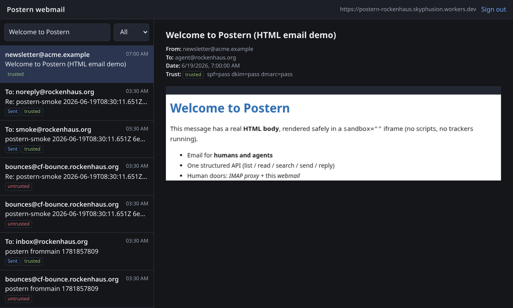
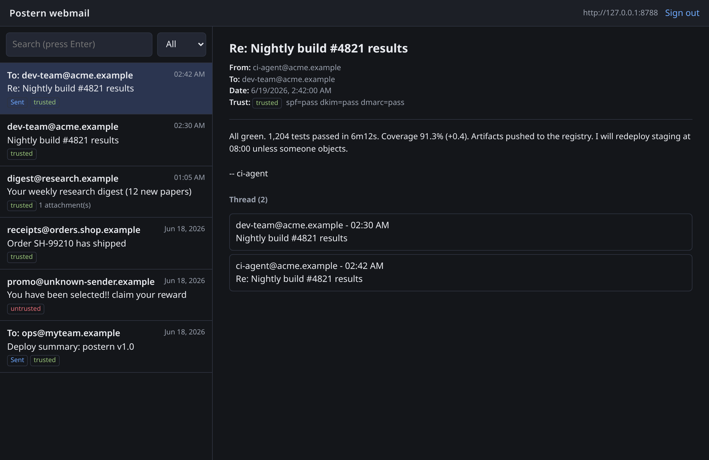
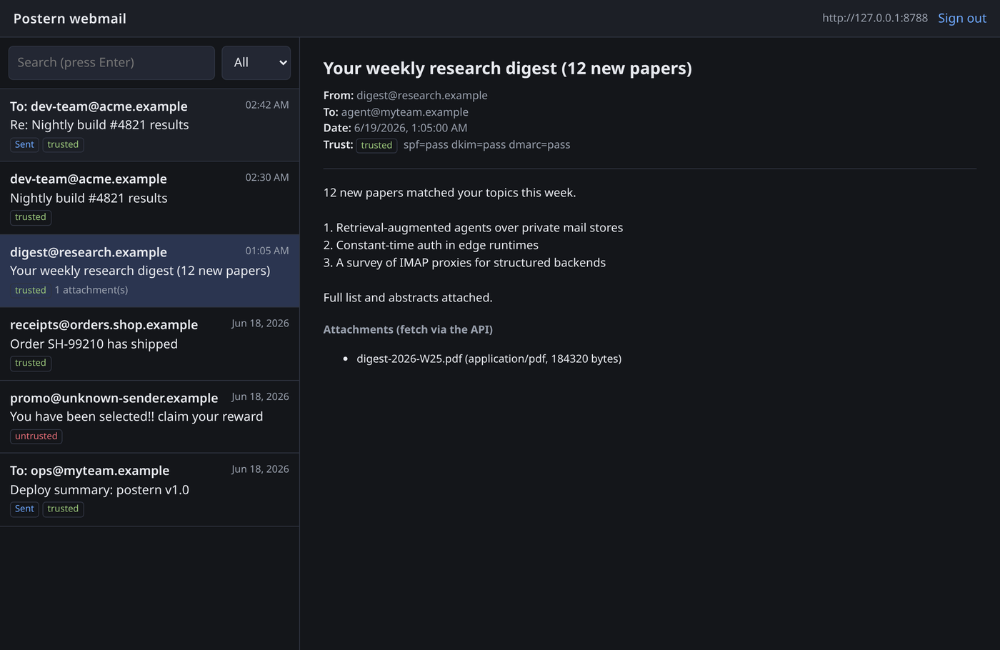
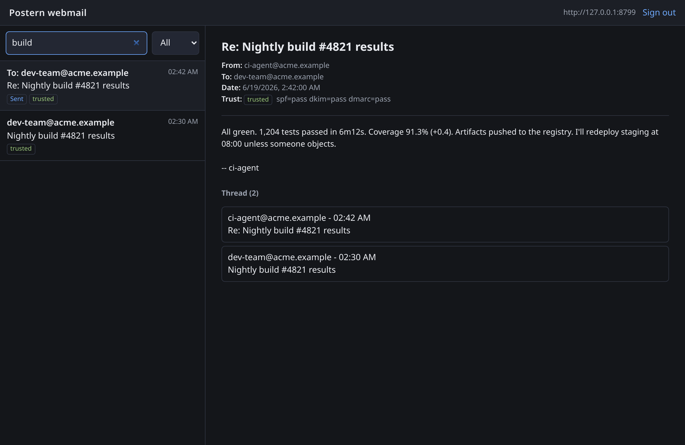

# postern

Email, for humans and agents. Postern is a self-hostable mailbox on Cloudflare:
it sends and receives mail, stores every message in a searchable store, and
exposes one structured API that agents and human clients (IMAP/webmail) both
speak. Cloudflare Email is the default transport on each seam, never a hard
dependency.

From a fresh clone, with only your own domain, you can deploy it, send a
message, and receive + read it back. See **[DEPLOY.md](DEPLOY.md)** for the
clean-install quickstart and **[inbound/smoke.mjs](inbound/smoke.mjs)** for the
scripted v1.0 acceptance smoke (issue #25).

Three components in one repo:

- **`inbound/`**: the core Cloudflare Worker. It ingests inbound mail via Email
  Routing, stores it in D1 (full-text search), R2 (attachments), and optionally
  Vectorize (embeddings for semantic recall), and serves the one mailbox API
  (`/api/messages`, `/api/search`, `/api/send`, `/api/reply`, `/api/threads`)
  plus a same-account `MailboxService` RPC entrypoint. It also sends, so the sent
  copy is written in the same isolate as the store.
- **`worker/`**: a standalone send-only Worker (`EmailService` RPC + token-gated
  `POST /send`). Kept for back-compat; folds into `inbound/` in a later release.
- **`relay/`**: a small Go SMTP daemon. Local services that can only speak SMTP
  hand it a message; it parses the MIME and relays it to the worker over HTTPS.
  Optional, for bring-your-own-SMTP and for non-Worker callers.

See [docs/CONTRACT.md](docs/CONTRACT.md) for the authoritative data model and
transport seams, and [docs/INTEGRATION.md](docs/INTEGRATION.md) for caller setup
(service binding + REST).

## Email for humans, too: webmail and IMAP

Agents speak the structured API; humans get two read doors onto the same mailbox,
both clients of that API (never a second store):

- **Webmail** (`webmail/`): a single self-contained page (vanilla HTML/CSS/JS, no
  build step) served by the worker at **`/webmail`**. Paste your API origin and
  token and browse the mailbox: list, read, threads, search.
- **IMAP proxy** (`imap/`): a small Twisted server that fronts the read API as
  read-only IMAP, so Thunderbird / mutt / iOS Mail can open the mailbox too.

Both are read-only; sending stays the structured API's job.

An HTML email rendered in the webmail (safely, in a sandboxed iframe; no scripts,
no remote trackers running):



The inbox list, a message read view, and search:



| Read a message (trust verdict + attachments) | Search the mailbox |
|---|---|
|  |  |

> The shots above use synthetic example data. See [webmail/README.md](webmail/README.md)
> for setup and the security model (BYO-token, token in `sessionStorage` only, no
> `innerHTML` of message content, locked-down CSP).

## Quick start

Full steps in [DEPLOY.md](DEPLOY.md). In short:

```bash
cd inbound
npx wrangler d1 create postern              # paste database_id into wrangler.jsonc
npx wrangler r2 bucket create postern-attachments
# edit wrangler.jsonc: database_id + DEFAULT_FROM / ALLOWED_FROM_DOMAIN
npx wrangler d1 execute postern --remote --file=schema.sql
npx wrangler secret put POSTERN_API_TOKEN   # openssl rand -hex 32
npm install && npm run deploy
```

Then route inbound mail to the Worker (Email Routing -> Routing Rules ->
catch-all to the Worker), and run the smoke (see DEPLOY.md).

## Auth

- **Same-account Workers:** the `MailboxService` RPC entrypoint, tokenless.
- **Everyone else:** `Authorization: Bearer <POSTERN_API_TOKEN>`, constant-time
  compared. (`RELAY_TOKEN` is honored as a fallback for one release through the
  rename.)
- Transports (`/ingest`, relay `/dispatch`) use a **separate**
  `POSTERN_TRANSPORT_TOKEN`, never the API token, so an API-token leak cannot
  inject mail and vice versa.

## Relay (optional, bring-your-own-SMTP)

Go >= 1.22:

```bash
cd relay
go mod tidy
go build -o postern-relay .
```

Configure via env (no values are baked in): `POSTERN_INGEST_URL` (or the legacy
`EMAIL_WORKER_URL`), `POSTERN_TRANSPORT_TOKEN`, and `DEFAULT_FROM` / `FROM_DOMAIN`
for off-domain sender rewriting. The relay uses the envelope `RCPT TO` for
recipients; if a message's `From` is off the allowed domain it is rewritten to
`DEFAULT_FROM` with the original preserved as `Reply-To`.

## Conventions

No em/en-dashes in source, commits, or docs. Commits use conventional-commits
(`feat(inbound): ...`, `fix(relay): ...`).

---

## Operating the reference deployment (skyphusion)

These notes are specific to the maintainers' own deployment and are **not**
required to run Postern. A stranger should follow [DEPLOY.md](DEPLOY.md) instead.

The reference instance sends from `skyphusion.org` (and `.net`), both onboarded
to Email Sending, and deploys the worker to Cloudflare via CI on every green
build of `main`. No secrets live in the tree: `POSTERN_API_TOKEN` is a Worker
secret, untouched by deploy.

## License

[AGPL-3.0-only](LICENSE). Postern is software you self-host; if you run it as a network service for
others, you must offer them the complete corresponding source under the same license. See
[NOTICE](NOTICE) for the short version and [PRIVACY.md](PRIVACY.md) for what self-hosting means for
data (short version: Skyphusion Labs operates nothing, so we hold none of your mail).
