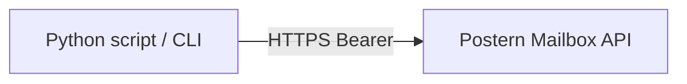

# postern-client (Python)

A dependency-light Python client + CLI for the **Postern mailbox API** (the
token-gated `/api/*` surface served by the inbound/store worker). Built so crew
agents and humans can hit the API without rebuilding tooling every session.

Stack map: [docs/architecture.md](../../docs/architecture.md).



- **Zero runtime dependencies.** Pure stdlib (`urllib`). No build step.
- **Importable client** (`PosternClient`) and a **CLI** (`postern`).
- **Per-user own key.** The API origin and token come from the environment
  (`POSTERN_API_URL` / `POSTERN_API_TOKEN`); nothing is hardcoded, the token is
  never logged, and the CLI **never** accepts the token as an argument (so it
  cannot leak into shell history, `ps`, or argv).

> Exposure posture: point `POSTERN_API_URL` at a loopback/mesh origin. The
> project does not expose the API publicly; this client does not change that.

## Install

```bash
cd clients/python
python -m venv .venv && . .venv/bin/activate
pip install -e .            # no runtime deps; pip install -e '.[dev]' adds mypy
```

This installs the `postern` command. Without installing you can run it as a
module: `python -m postern_client ...`.

## Configure (bring your own key)

```bash
export POSTERN_API_URL=https://<the-postern-api-origin>
export POSTERN_API_TOKEN=<your-postern-api-token>
# verify the var is set WITHOUT echoing it:
echo "POSTERN_API_TOKEN is ${POSTERN_API_TOKEN:+SET}"
```

See [`.env.example`](.env.example). The token is a real credential: keep it out
of tracked files and shell history.

## CLI usage

```bash
postern ping                                   # validate your token

# send a message
postern send --to alice@example.com --subject "Hello" --text "hi there"
postern send --to a@x.com --to b@x.com --subject "Report" \
  --html "<p>see attached thinking</p>" --header X-Tag=ops
postern send --to a@x.com --subject "Long note" --text-file ./body.txt   # or - for stdin

# reply to a stored message (threads automatically)
postern reply <message-id> --text "thanks, got it"

# list with filters + pagination
postern list --direction inbound --limit 20
postern list --from alice@example.com --cursor "<cursor-from-previous-page>"

# read one message / a whole thread
postern get <message-id>
postern thread <thread-id>

# search (mode: fts | semantic | hybrid)
postern search "invoice overdue" --mode hybrid --limit 10

# download the i-th attachment of a message
postern attachment <message-id> 0 -o ./invoice.pdf
```

All commands print the API's JSON to stdout (so you can pipe into `jq`); the
`attachment` command writes bytes to a file and prints a one-line summary to
stderr. Exit codes: `0` ok, `1` error, `2` auth failure (bad/missing token).

Override the origin (not the token) per invocation with `--api-url`:

```bash
postern --api-url http://127.0.0.1:8787 ping
```

## Library usage

```python
from postern_client import from_env, PosternClient, PosternError

# build from POSTERN_API_URL / POSTERN_API_TOKEN
client = from_env()

# ...or construct explicitly (e.g. a token you loaded from your own secret store)
client = PosternClient("https://postern.example", token)

res = client.send("alice@example.com", "Hello", text="hi there")
print(res["messageId"], res["threadId"])

page = client.list_messages(direction="inbound", limit=20)
for summary in page["items"]:
    print(summary["messageId"], summary.get("subject"))
if page["cursor"]:
    nxt = client.list_messages(direction="inbound", limit=20, cursor=page["cursor"])

msg = client.get_message("<message-id>")           # dict, or None if absent
thread = client.get_thread("<thread-id>")          # list[dict]
hits = client.search("invoice", mode="hybrid")     # {"items": [...], "cursor": ...}

att = client.get_attachment("<message-id>", 0)     # Attachment(body, mime, filename)
with open(att.filename, "wb") as fh:
    fh.write(att.body)
```

Errors raise `PosternError` (with `.status` and the API `.code`, e.g.
`E_FIELD_MISSING`); a bad token raises `PosternAuthError`. Methods return the
API's parsed JSON, so the keys match the worker contract exactly.

## API surface

| method | endpoint | returns |
|---|---|---|
| `send` | `POST /api/send` | `{messageId, threadId, ...}` |
| `reply` | `POST /api/reply` | `{messageId, threadId, ...}` |
| `list_messages` | `GET /api/messages` | `{items: [summary], cursor}` |
| `get_message` | `GET /api/messages/{id}` | message dict or `None` |
| `get_thread` | `GET /api/threads/{id}` | `[message]` |
| `search` | `GET /api/search` | `{items: [{message, ...}], cursor}` |
| `get_attachment` | `GET /api/messages/{id}/attachments/{i}` | `Attachment(body, mime, filename)` |
| `ping` | `GET /api/messages?limit=1` | `bool` |

## Tests

```bash
cd clients/python
python -m unittest discover -s postern_client/tests   # no network (injected transport)
python -m mypy                                         # the type gate (house style)
```

The transport is injectable, so the suite runs entirely offline; the API is
faked, no token or origin is needed to test.
