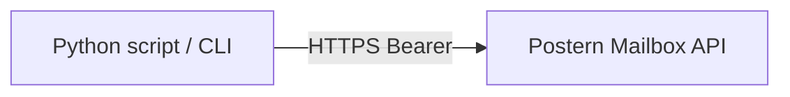

# postern-client (Python)

[](https://pypi.org/project/postern-client/)

A dependency-light Python client + CLI for the **Postern mailbox API** (the
token-gated `/api/*` surface served by the inbound/store worker). Built so crew
agents and humans can hit the API without rebuilding tooling every session.

Stack map: [docs/architecture.md](../../docs/architecture.md).


```mermaid
flowchart LR
    script[Python script / CLI] -->|HTTPS Bearer| api[Postern Mailbox API]
```

- **Zero runtime dependencies.** Pure stdlib (`urllib`). No build step.
- **Importable client** (`PosternClient`) and a **CLI** (`postern`).
- **Per-user own key.** The API origin and token come from the environment
  (`POSTERN_API_URL` / `POSTERN_API_TOKEN`); nothing is hardcoded, the token is
  never logged, and the CLI **never** accepts the token as an argument (so it
  cannot leak into shell history, `ps`, or argv).

> Exposure posture: point `POSTERN_API_URL` at a loopback/mesh origin. The
> project does not expose the API publicly; this client does not change that.

## Install

**PyPI** ([postern-client](https://pypi.org/project/postern-client/); GitHub
Release `v*` matching `pyproject.toml` triggers CI publish):

```bash
pip install postern-client
postern --help
```

**From source** (development):

```bash
cd clients/python
python -m venv .venv && . .venv/bin/activate
pip install -e .            # no runtime deps; pip install -e '.[dev]' adds mypy
```

This installs the `postern` command. Without installing you can run it as a
module: `python -m postern_client ...`.

## Configure (bring your own key)

```bash
export POSTERN_API_URL=https://<the-postern-api-origin>
export POSTERN_API_TOKEN=<your-postern-api-token>
# verify the var is set WITHOUT echoing it:
echo "POSTERN_API_TOKEN is ${POSTERN_API_TOKEN:+SET}"
```

See [`.env.example`](.env.example). The token is a real credential: keep it out
of tracked files and shell history.

## CLI usage

```bash
postern ping                                   # validate your token

# send a message
postern send --to alice@example.com --subject "Hello" --text "hi there"
postern send --to a@x.com --to b@x.com --subject "Report" \
  --html "<p>see attached thinking</p>" --header X-Tag=ops
postern send --to a@x.com --subject "Long note" --text-file ./body.txt   # or - for stdin

# reply to a stored message (threads automatically)
postern reply <message-id> --text "thanks, got it"

# list with filters + pagination
postern list --direction inbound --limit 20
postern list --from alice@example.com --cursor "<cursor-from-previous-page>"

# "did anything ARRIVE for this address": --direction is the stored fact, so the
# stored copy of a message we SENT to it never answers yes
postern list --to abuse@example.com --direction inbound
# that address's own INBOX view instead (arrivals + same-domain mail others sent it)
postern list --to abuse@example.com --lens inbox

# read one message / a whole thread
postern get <message-id>
postern thread <thread-id>

# durable folders: Archive / Trash / Junk are only reachable with --mailbox
postern list --mailbox trash --limit 20
# a shared role queue: filter on the ROLE, project the HUMAN's read state
postern list --to abuse@example.com --lens inbox --seen-for you@example.com

# search (mode: fts | substr | semantic | hybrid; substr pairs with --field)
postern search "invoice overdue" --mode hybrid --limit 10
postern search "PO-1234" --mode substr --field subject
postern search "invoice" --to me@example.com --mailbox archive \
  --after 2026-01-01 --before 2026-02-01 --has-attachment --unseen

# attachments: download the i-th one, or attach files to a send/reply
postern attachment <message-id> 0 -o ./invoice.pdf
postern send --to a@x.com --subject "Report" --text "attached" \
  --attach ./report.pdf --attach ./chart.png
postern reply <message-id> --text "here it is" --mode replyAll --quote --attach ./fix.patch

# folders + read state (folders carry server-authoritative unread counts)
postern folders --to me@example.com
postern seen <message-id> --for me@example.com      # --unread to undo
postern flags <message-id> --flagged --unanswered
postern move <message-id> --mailbox trash           # --mailbox none restores it
postern delete <message-id>                         # HARD delete, needs a delete-scoped token

# drafts (needs a token bound to an identity; see docs/SEND-IDENTITIES.md)
postern drafts list
postern drafts create --to a@x.com --subject "WIP" --text "half a thought"
postern drafts attach <draft-id> ./deck.pdf
postern drafts update <draft-id> --subject "WIP v2" --text "..." --updated-at <its-updatedAt>
postern drafts send <draft-id>
```

`drafts update` REPLACES the document and the worker requires the draft's current
`updatedAt` (optimistic concurrency), so an edit is always read-modify-write:
`postern drafts get <id>`, change what you want, then PUT it back with that
`updatedAt`. Anything you leave out is cleared, and a stale (or missing)
`--updated-at` is refused with `E_CONFLICT` rather than clobbering a newer revision.

All commands print the API's JSON to stdout (so you can pipe into `jq`); the
`attachment` command writes bytes to a file and prints a one-line summary to
stderr. Exit codes: `0` ok, `1` error, `2` auth failure (bad/missing token).

Override the origin (not the token) per invocation with `--api-url`:

```bash
postern --api-url http://127.0.0.1:8787 ping
```

## Library usage

```python
from postern_client import from_env, PosternClient, PosternError

# build from POSTERN_API_URL / POSTERN_API_TOKEN
client = from_env()

# ...or construct explicitly (e.g. a token you loaded from your own secret store)
client = PosternClient("https://postern.example", token)

res = client.send("alice@example.com", "Hello", text="hi there")
print(res["messageId"], res["threadId"])

page = client.list_messages(direction="inbound", limit=20)
for summary in page["items"]:
    print(summary["messageId"], summary.get("subject"))
if page["cursor"]:
    nxt = client.list_messages(direction="inbound", limit=20, cursor=page["cursor"])

msg = client.get_message("<message-id>")           # dict, or None if absent
thread = client.get_thread("<thread-id>")          # list[dict]
hits = client.search("invoice", mode="hybrid")     # {"items": [...], "cursor": ...}

att = client.get_attachment("<message-id>", 0)     # Attachment(body, mime, filename)
with open(att.filename, "wb") as fh:
    fh.write(att.body)

# send with attachments (raw bytes in, base64 over JSON on the wire)
from postern_client import OutboundAttachment

client.send(
    "alice@example.com", "Report",
    text="attached",
    attachments=[OutboundAttachment.from_path("./report.pdf")],
)
client.reply("<message-id>", text="fixed", mode="replyAll", quote_original=True)

# the full search filter set (the worker validates each one strictly)
client.search(
    "invoice", mode="substr", field="subject", direction="inbound",
    to="me@example.com", mailbox="archive", seen_for="me@example.com",
    after="2026-01-01", before="2026-02-01", has_attachment=True, seen=False,
)

# durable folders + read state
client.get_folders(to="me@example.com")            # names + unread counts + UIDVALIDITY
client.list_messages(mailbox="trash", limit=20)
client.set_seen(["<message-id>"], True, for_addr="me@example.com")   # -> updated count
client.set_flags(["<message-id>"], flagged=True)
client.move_messages(["<message-id>"], "archive")  # None restores the default view
client.delete_message("<message-id>")              # HARD delete (delete-scoped token)

# drafts: identity-owned, so this needs a per-identity token, not an operator one
created = client.create_draft(to="alice@example.com", subject="WIP", body_text="...")
draft = client.get_draft(created["id"])
client.update_draft(draft["id"], subject="WIP v2", body_text="...", updated_at=draft["updatedAt"])
client.add_draft_attachment(draft["id"], b"<bytes>", filename="deck.pdf", mime_type="application/pdf")
client.send_draft(draft["id"])
```

Errors raise `PosternError` (with `.status` and the API `.code`, e.g.
`E_FIELD_MISSING`); a bad token raises `PosternAuthError`. Methods return the
API's parsed JSON, so the keys match the worker contract exactly.

## API surface

| method | endpoint | returns |
|---|---|---|
| `send` | `POST /api/send` | `{messageId, threadId, ...}` |
| `reply` | `POST /api/reply` | `{messageId, threadId, ...}` |
| `list_messages` | `GET /api/messages` | `{items: [summary], cursor}` |
| `get_message` | `GET /api/messages/{id}` | message dict or `None` |
| `get_thread` | `GET /api/threads/{id}` | `[message]` |
| `search` | `GET /api/search` | `{items: [{message, ...}], cursor}` |
| `get_attachment` | `GET /api/messages/{id}/attachments/{i}` | `Attachment(body, mime, filename)` |
| `get_folders` | `GET /api/folders` | `[folder]` (unread counts, UIDVALIDITY) |
| `set_seen` | `POST /api/messages/seen` | updated count |
| `set_flags` | `POST /api/messages/flags` | updated count |
| `move_messages` | `POST /api/messages/move` | updated count |
| `delete_message` | `DELETE /api/messages/{id}` | `None` (raises on 403/404) |
| `list_drafts` / `get_draft` | `GET /api/drafts[/{id}]` | `[draft]` / draft or `None` |
| `create_draft` / `update_draft` | `POST /api/drafts`, `PUT /api/drafts/{id}` | `{id, draft}` / `{draft}` |
| `delete_draft` / `send_draft` | `DELETE`, `POST /api/drafts/{id}/send` | `None` / `{messageId, ...}` |
| `list_draft_attachments` / `add_draft_attachment` / `delete_draft_attachment` | `/api/drafts/{id}/attachments[/{aid}]` | `[attachment]` / attachment / `None` |
| `ping` | `GET /api/messages?limit=1` | `bool` |

**Scopes** ([AUTH-CONTRACT](../../docs/AUTH-CONTRACT.md)): reads and read-state writes
(`seen` / `flags` / `move`) need `read`; send, reply, and drafts need `send`;
`delete_message` needs `delete`. Drafts additionally need a token that BINDS an
identity (a per-identity send credential,
[SEND-IDENTITIES](../../docs/SEND-IDENTITIES.md)); a static operator token is
refused with `E_IDENTITY_REQUIRED` because no owner can be derived from it.

## Tests

```bash
cd clients/python
python -m unittest discover -s postern_client/tests   # no network (injected transport)
python -m mypy                                         # the type gate (house style)
```

The transport is injectable, so the suite runs entirely offline; the API is
faked, no token or origin is needed to test.

A fake transport can never disagree with the client, which is exactly how this
package drifted a feature generation behind the worker with green tests (#413).
Two things close that gap:

- `postern_client/tests/test_worker_contract.py` reads the accepted parameter,
  body-key, and route names straight out of `inbound/src/*.ts` and asserts the
  client only emits names the worker actually reads, so a worker-side rename
  fails here. It skips automatically when the worker source is absent (an
  installed wheel ships neither the tests nor the worker).
- Before trusting a change, run it against a REAL worker:

  ```bash
  cd inbound
  printf 'POSTERN_API_TOKEN=<a-throwaway-local-token>\n' > .dev.vars   # gitignored
  npx wrangler d1 migrations apply postern-dev --local --config wrangler.dev.jsonc
  npx wrangler dev --config wrangler.dev.jsonc --port 8901 --ip 127.0.0.1
  # then, from clients/python, point the client at http://127.0.0.1:8901 and
  # exercise the surface: every filter should be ACCEPTED, and a deliberately
  # bogus value (direction=sideways, field=nope, mailbox=attic) must come back
  # 400 E_VALIDATION_ERROR. A refusal you never watched happen is not a test.
  ```

## License

MIT (see [LICENSE](LICENSE)). The Postern server core is AGPL-3.0-only; this
client is MIT to maximize reuse, matching the other Postern client integrations.
