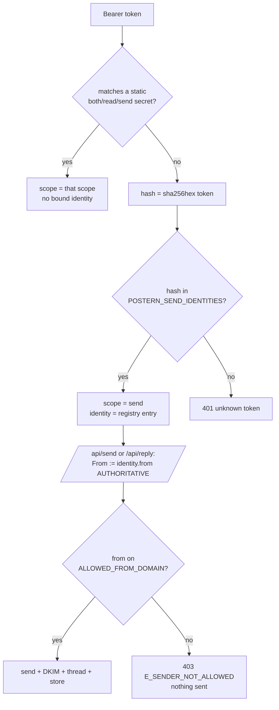

# Per-identity send registry (#28)

> Interface Control Document. This file is the contract: the registry var, its
> JSON shape, how a token maps to a From, and how an operator registers a new
> per-member token. Reproducible from this doc alone.

## 1. Why

Postern's `#85` token-scope split bounds a leaked credential to a **function**
(`read` / `send` / `both`). The per-identity send registry takes the next step so a
send token also carries **who**: many send-scoped tokens, each the SAME `send` scope
but a **distinct, authoritative sender identity**. Everyone (crew today, released-product
users at the end state) sends mail as a first-class capability, but **as themselves**,
through their own per-identity token, never through one shared god-token.

The endstate this serves: openness AND accountability converge by decomposing send into
**per-identity credentials**, not by restricting who may send.

## 2. The registry var

| Name | `POSTERN_SEND_IDENTITIES` |
|---|---|
| Kind | Worker config **var** (`wrangler.jsonc` `"vars"`), NOT a secret (#335; see below) |
| Worker | `postern` (the inbound worker, `inbound/`) |
| Optional | Yes. Unset/empty = the static `both`/`read`/`send` posture only (fully back-compat). |
| Holds | Token **hashes**, never raw tokens (see section 5). |

It is mirrored in the hand-authored `Env` interface (`inbound/src/env.d.ts`); no
`worker-configuration.d.ts` is generated.

**Why a var and not a secret (#335).** The registry stores sha256 hashes and display
names only, so by construction it holds no credential: making it write-only buys no
confidentiality. A Worker secret cannot be read back, so a write-only registry cannot
be merged (adding one identity risks destroying the rest), diffed, or recovered. As a
var it is readable, mergeable, and always recoverable from the deployed worker.
Because `wrangler deploy` replaces vars (only secrets persist across deploys), the
registry lives in the wrangler config you deploy with; adding an identity is a config
edit plus a redeploy.

**Migrating a pre-#335 deployment** (registry currently held as a Worker secret):
copy your registry JSON into the `"vars"` block of your deploy config, then
`wrangler secret delete POSTERN_SEND_IDENTITIES` and `wrangler deploy`. Delete the
secret FIRST: a config var cannot deploy over an existing secret of the same name.
Between the delete and the deploy, registry tokens 401 (deny-only, no escalation;
static tokens are unaffected), so do both steps back to back.

## 3. JSON shape

A single JSON **object** mapping the lowercase **sha256 hex** of a send token to its
bound identity:

```json
{
  "9f86d081884c7d659a2feaa0c55ad015a3bf4f1b2b0b822cd15d6c15b0f00a08": {
    "from": "rollins@skyphusion.org",
    "displayName": "Rollins"
  },
  "2c26b46b68ffc68ff99b453c1d30413413422d706483bfa0f98a5e886266e7ae": {
    "from": "strummer@skyphusion.org"
  }
}
```

| Field | Type | Rule |
|---|---|---|
| key | string | lowercase sha256 hex of the raw Bearer token (exactly 64 hex chars) |
| `from` | string | the AUTHORITATIVE sender address. MUST be a valid address on `ALLOWED_FROM_DOMAIN` (default `skyphusion.org`), enforced at resolve time (section 4). |
| `displayName` | string? | optional. Becomes the From display name (`Name <addr>`). |

(The hashes shown above are illustrative, not real tokens.)

## 4. Resolution and From-binding (the runtime contract)

On every `/api` request the worker resolves the presented `Authorization: Bearer <token>`
in two ordered stages (`inbound/src/api.ts` -> `resolveToken`, `inbound/src/sendidentity.ts`):

1. **Static scope tokens first**, constant-time compared: `POSTERN_API_TOKEN`
   (`both`), `POSTERN_API_TOKEN_READ` (`read`), `POSTERN_API_TOKEN_SEND` (`send`). A
   static match wins and carries **no** bound identity (back-compat From rules apply).
2. **Only if no static token matched**, the registry: the worker computes
   `sha256hex(token)` and looks it up in `POSTERN_SEND_IDENTITIES`. A hit grants
   `send` scope **plus** the bound identity. A miss is an unknown token -> `401`.

When a request to `POST /api/send` or `POST /api/reply` is authorized by a registry
token, the worker **overrides** the outbound `From` to the bound identity, discarding
any caller-supplied `from`. A token cannot send as anyone else. The bound address then
flows through the SAME validation as any From (shape, `ALLOWED_FROM_DOMAIN`, CRLF
safety), so a misconfigured registry From fails **loud** (`403 E_SENDER_NOT_ALLOWED`,
nothing sent), never a silent send from a bad address.

**Domain policy is authoritative over the registry.** When the worker parses the
registry it ALSO enforces `ALLOWED_FROM_DOMAIN`: an entry whose `from` is outside the
allowed domain is dropped at resolve time (its token resolves to nothing -> `401`) and
logged. The per-identity From is authoritative over the CALLER, but a registry entry
can never WIDEN the sender domain, so a fat-fingered or tampered entry cannot make the
worker send as an arbitrary external domain. `resolveFrom`'s own domain check stays as
a second layer behind this.

DKIM signing, threading, the In-Reply-To/References chain, and the outbound sent-copy
store-back are all unchanged: only the `From` is now authoritatively bound.



## 5. Why hashes, not raw tokens

The registry stores `sha256(token)`, so the secret itself never holds a plaintext send
credential: a read of the secret does not yield usable tokens. Resolution hashes the
presented Bearer and indexes the map by that hash. The Map lookup is not constant-time,
but it indexes a hash of a high-entropy secret (not the secret), so it does not leak the
token. The static-token path keeps the existing constant-time compare.

## 6. Deny-by-default (failure modes)

The registry can only DENY, never escalate, and never breaks the static tokens:

| Condition | Result |
|---|---|
| Token not static and not in the registry | `401` unknown token |
| Registry var unset / empty | No registry tokens; static posture only |
| Registry var is malformed JSON | The whole registry is empty (its tokens 401); static tokens unaffected |
| Registry entry key is not 64-char sha256 hex | That entry skipped |
| Registry entry `from` missing or not a valid address | That entry skipped (its token 401) |
| Registry entry `from` valid but off `ALLOWED_FROM_DOMAIN` | Entry dropped at resolve time + logged; its token resolves to nothing -> `401`, nothing sent (`resolveFrom`'s `403 E_SENDER_NOT_ALLOWED` is the second layer) |

## 7. Operator: register a new per-member token

No code change -- the registry var in your deploy config is extended, then redeployed.

```sh
# 1. Mint a high-entropy raw token (per-identity credential).
TOKEN=$(openssl rand -hex 32)

# 2. Hash it (lowercase sha256 hex == the registry key).
HASH=$(printf %s "$TOKEN" | sha256sum | cut -d' ' -f1)

# 3. MERGE the new entry into the CURRENT registry value (never overwrite blind;
#    the current value is readable from your deploy config, or from the live
#    worker if the config drifted):
#    { "<HASH>": { "from": "<member>@skyphusion.org", "displayName": "<Name>" }, ... }
#    Put the merged object in the "vars" block of your wrangler config as
#    POSTERN_SEND_IDENTITIES (JSON as a string), then:
wrangler deploy

# 4. Hand each member their RAW $TOKEN out of band (e.g. crew-secrets, per-member
#    age recipient). The raw token NEVER lands in the registry or any tracked file.
```

Each member then presents their own raw token as `Authorization: Bearer <token>` from
their own MCP / client config; the worker binds the From to their identity.

To rotate: mint a new token, add its hash, deploy, hand out the new raw token, then
remove the old hash on the next deploy. To revoke: remove the hash and redeploy.

## 8. Scope and boundaries

- Registry tokens are `send` scope ONLY. They cannot read the store (`GET` doors -> `403`)
  and cannot reach credential-admin / reindex / reconcile (`403`); those remain `both`-only.
- The registry is purely ADDITIVE. The static `POSTERN_API_TOKEN_SEND` keeps working as
  the **un-bound** send token (From falls back to the caller's `from` / `DEFAULT_FROM`,
  validated against `ALLOWED_FROM_DOMAIN`), so existing single-key and scoped-token
  deployments are unchanged.
- This is the backend half of the per-identity send rollout. It pairs with the shared
  god-token retirement (#28); minting the per-member tokens + setting this secret + the
  MCP/client wiring are the infra half.

## 9. Provenance

| Item | Location |
|---|---|
| Resolver + registry | `inbound/src/sendidentity.ts`, `inbound/src/api.ts` (`resolveToken`) |
| From-binding | `inbound/src/mailbox.ts` (`resolveFrom`, `send`, `reply`) |
| Env mirror | `inbound/src/env.d.ts` (`POSTERN_SEND_IDENTITIES`) |
| Tests | `inbound/per-identity-send.test.ts`, `inbound/scopes.test.ts` |
| Scope table | `docs/AUTH-CONTRACT.md` section 7 |
