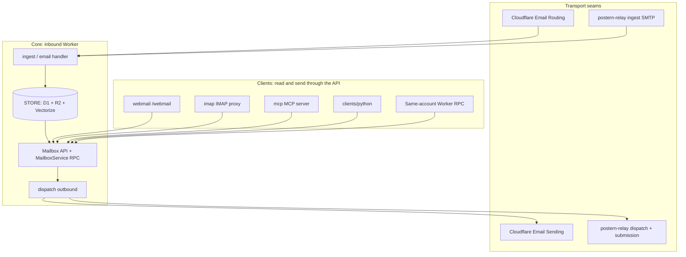
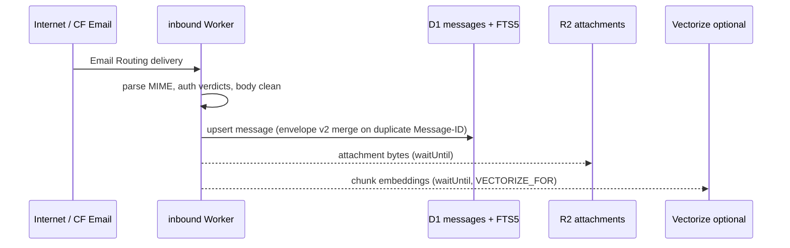
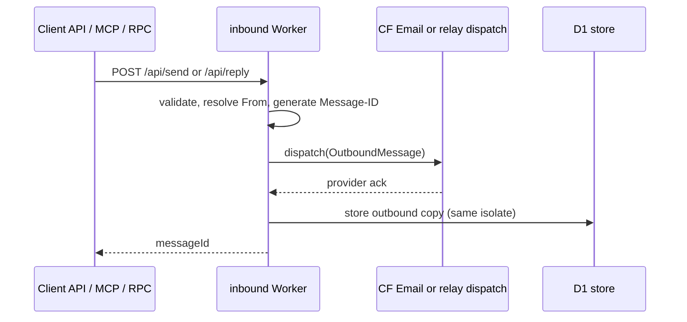
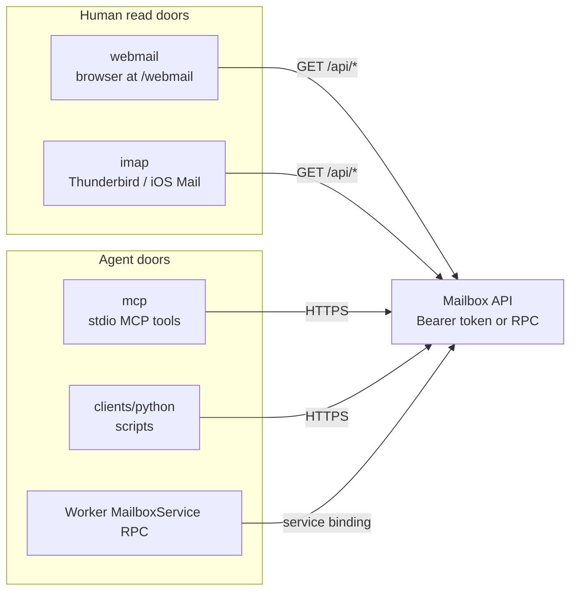
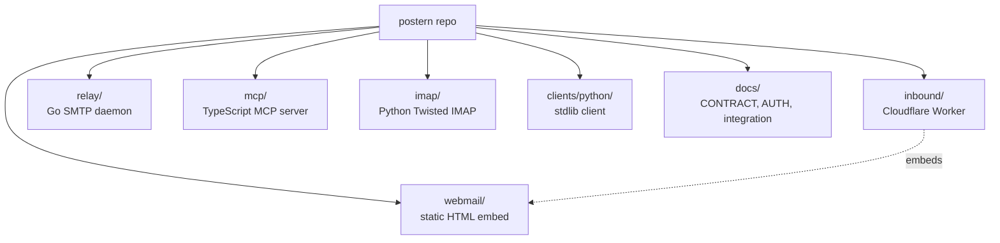

# Postern architecture map

Postern is not one program. It is a small group of programs that share **one mailbox
store** and **one structured API**. Human doors (webmail, IMAP) and agent doors (MCP,
Python, RPC) are **clients** of that API; they never hold a second copy of the mail.

The authoritative data model and transport seams live in [CONTRACT.md](CONTRACT.md).
This page is the visual map; every component README links here so you always know where
you are in the stack.

## The stack at a glance

Load-bearing rule: **transports write in; clients read (and send) out.** The store is
the single source of truth.

## Inbound path

Alternate ingest: the **relay** accepts SMTP on loopback, parses MIME, and POSTs to
`POST /ingest` (transport token). Same store path as CF Email Routing.

## Outbound path

Submission SMTP (587/465) on the relay authenticates per user, enforces `From == identity`,
maps MIME to the same send shape, and forwards to the worker. See [AUTH-CONTRACT.md](AUTH-CONTRACT.md).

## Client doors

| Component | Role | Send? | Published as |
|-----------|------|-------|--------------|
| `inbound/` | Core Worker: store, API, ingest, dispatch | yes (API) | -- |
| `relay/` | Optional SMTP bridge: ingest, submission, BYO dispatch | via worker | -- |
| `mcp/` | MCP tools for agents (`mailbox_search`, `mailbox_send`, ...) | opt-in send | [`@skyphusion/postern-mcp` on npm](https://www.npmjs.com/package/@skyphusion/postern-mcp) |
| `webmail/` | Self-contained read UI served at `/webmail` | no (v1) | -- |
| `imap/` | Read-only IMAP front for MUAs | no (v1) | -- |
| `clients/python/` | Thin stdlib HTTP client + CLI | if token allows | [`postern-client` on PyPI](https://pypi.org/project/postern-client/) |

Search modes on `/api/search`: `fts` (keyword), `semantic` (Vectorize), `hybrid` (both).
MCP and webmail default to **hybrid** when Vectorize is bound.

## Repo layout

## Further reading

- [CONTRACT.md](CONTRACT.md) -- data model, ingest/dispatch shapes, envelope v2
- [AUTH-CONTRACT.md](AUTH-CONTRACT.md) -- API vs transport tokens, submission auth
- [SEND-IDENTITIES.md](SEND-IDENTITIES.md) -- per-identity send registry
- [INTEGRATION.md](INTEGRATION.md) -- RPC binding + REST examples
- [DEPLOY.md](../DEPLOY.md) -- clean-install quickstart
