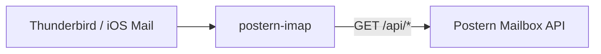

# postern-imap

An **IMAP proxy frontend for [Postern](../README.md)**: it serves the one Postern
mailbox over plain IMAP so a human (Thunderbird, mutt, iOS Mail, ...) or an
IMAP-speaking agent can read mail that arrived through Postern, without ever
touching D1/R2 directly.

Stack map: [docs/architecture.md](../docs/architecture.md).

**Production image:** `imap/Dockerfile` builds `ghcr.io/skyphusion-labs/postern-imap`
on **Python 3.14 slim** (stay current; do not pin back without cause). Fleet deploy
record: `fleet-chezmoi/system/postern-imap/README.md`.



Postern is "one mailbox reachable two ways: by agents (the structured API) and by
humans (IMAP/webmail, which are *clients* of that same API)" (see
[`docs/CONTRACT.md`](../docs/CONTRACT.md)). This proxy is exactly that human door:
it is a **client of the Postern mailbox read API** (`/api/messages`,
`/api/messages/{id}`, `/api/threads/{id}`, `/api/search`), and it renders each
stored message back into RFC822 for IMAP FETCH.

It is built on Twisted's `twisted.mail.imap4` server, per the shape Conrad sketched
in #12.

## What it does (v1)

- **Read-only store, with ONE exception: the `\Seen` (read/unread) flag.** `LOGIN`,
  `LIST`/`LSUB`, `SELECT`/`EXAMINE`, `STATUS`, `FETCH`, `SEARCH`, `LOGOUT`. You read
  mail here; you **send** through the structured API (`POST /api/send` / `/api/reply`)
  or the submission server, not by IMAP. Read state IS persisted: a `STORE +/-FLAGS
  (\Seen)` round-trips to `POST /api/messages/seen`, so marking a message read/unread
  sticks across clients and sessions and a human can tell new mail from mail they have
  already read. Inbound mail arrives **unread**; the mailbox's own sent copies are
  stored **read**. The real views (INBOX/Sent/All) SELECT as `READ-WRITE` with
  `PERMANENTFLAGS (\Seen \Deleted)`. `STORE +/-FLAGS (\Deleted)` is session-local
  until `EXPUNGE`, which hard-deletes via `DELETE /api/messages/{id}` (requires
  **POSTERN_API_TOKEN_DELETE**, a `both`-scoped member on the worker, separate from
  the read token). **Apple Mail** deletes by COPY/MOVE to Trash instead; COPY to
  Trash is handled as the same hard-delete (Trash is not a second store; staged
  summaries are shared across IMAP connections until EXPUNGE or reconnect). Archive
  is an empty placeholder and is never used for deletes. Attachment parts include
  Content-Type `name=` for BODYSTRUCTURE so MUAs recognize PDFs without an Open With
  prompt. IMAP FETCH serves base64 wire bytes (never cte=binary, which strips CR from
  PDFs). Every other write -- any other flag,
  mailbox create/rename/delete -- is refused cleanly (tagged `NO`).
- **`APPEND` is accepted as a no-op for Sent and Drafts.** A mail client copies its own sent message
  into `Sent` after submission; the Postern submission path already records the
  outbound message in the store, so the proxy acknowledges the `APPEND` (it never
  fails the client) and does NOT double-store. The sent mail appears once, via the
  store, on the next `SELECT`. Apple Mail auto-saves mid-compose into `Drafts`;
  Postern acknowledges that APPEND so the client keeps its local draft without an
  error dialog. Drafts has no server-side store and remains empty after reconnect.
  `SUBSCRIBE`/`UNSUBSCRIBE` are likewise accepted.
- **Mailboxes with RFC 6154 special-use attributes**, so a real client
  (Thunderbird) auto-maps its folders and never tries to CREATE them. `INBOX`,
  `Sent`, and `All` are direction-filtered views over the one store; the rest are
  present-but-empty placeholders (no backing state in v1, no API hit):
  - `INBOX` -> inbound mail
  - `Sent` (`\Sent`) -> outbound mail (the stored sent copies)
  - `All` (`\All`) -> both directions
  - `Drafts` (`\Drafts`), `Trash` (`\Trash`), `Junk` (`\Junk`), `Archive` (`\Archive`) -> empty placeholders
- **Zero new state.** The proxy owns no database; it reads the live API per
  session with the caller's own token.

## Auth model (#32, expanded for #77)

A normal mail client uses ONE username+password for BOTH doors: IMAP to receive
and SMTP to send. The SMTP relay (`relay/`) authenticates that credential three
ways via a pluggable `AuthProvider`; the IMAP proxy mirrors the same backends so
**one credential opens both doors**. Pick the backend with
`POSTERN_IMAP_AUTH_MODE`:

| mode | IMAP username | IMAP password | what the proxy holds | mirrors relay |
|---|---|---|---|---|
| `token` (default) | a free label (use the mailbox address) | **the Postern API token** | nothing | -- |
| `fixed` | a configured username | a configured password | the API token (`POSTERN_API_TOKEN`) | -- |
| `native` | the mailbox address | the user's SMTP secret | a per-function service token + the transport token | `AUTH_BACKEND=native` |
| `ldap` | the directory login | the directory password | a per-function service token (direct-bind: NO directory secret) | `AUTH_BACKEND=ldap` |
| `system` | a local Unix user | the Unix password | a per-function service token | `AUTH_BACKEND=system` |

- **`token` mode** stores no secret in the proxy and validates the token *live*
  against the API at login. BYO-token / no-lock-in default; the user pastes the
  64-char token as their "password", which some mail clients dislike.
- **`fixed` mode** is the convenience path for a one-person self-host: put the API
  token in the proxy env, pick a normal password. Comparisons are constant-time.
- **`native` / `ldap` / `system`** authenticate the **user** (against the worker
  `POST /api/smtp-auth`, an LDAP bind over TLS, or local PAM), then the proxy reads
  the store with a **per-function service token** it holds (`POSTERN_API_TOKEN`).
  These two steps are deliberately separate: authenticate-the-user, then
  act-on-the-store-with-the-service-token. This is a **posture shift** -- in
  `token` mode the proxy holds no secret; in these modes it holds a service token.
  See the operator deploy runbook (maintained out-of-tree) for exactly what
  secret is held in each mode, by function, and where it is stored.

`native` is stdlib-only (urllib). `ldap` needs the pure-Python `ldap3`
(`pip install -e '.[ldap]'`) and `system` needs `python-pam`
(`pip install -e '.[pam]'`); both are imported lazily, so the default install
stays dependency-light. No token or password is ever logged.

Run the proxy **behind TLS or on loopback** (the password is a real credential):
set `POSTERN_IMAP_TLS_CERT`/`POSTERN_IMAP_TLS_KEY`, or front a loopback listener
with stunnel. When TLS is enabled the listener enforces a **TLS 1.2 minimum** (the
deprecated TLS 1.0/1.1 are never offered, mirroring the SMTP relay; #106). By
default it binds `127.0.0.1:1143`. Exposing **993 (IMAPS)** is gated -- see the
operator deploy runbook (out-of-tree).

## Configuration

All config is environment-driven (no flags), so it drops into a systemd
`EnvironmentFile` or a container. See [`.env.example`](.env.example).

| Variable | Required | Default | Meaning |
|---|---|---|---|
| `POSTERN_API_URL` | yes | -- | Postern mailbox API origin, e.g. `https://postern.example` |
| `POSTERN_IMAP_AUTH_MODE` | no | `token` | `token`, `fixed`, `native`, `ldap`, or `system` (`pam` aliases `system`) |
| `POSTERN_API_TOKEN` | in `fixed`/`native`/`ldap`/`system` | -- | the token the proxy presents: the login token in `fixed`, the per-function **service** token in `native`/`ldap`/`system` |
| `POSTERN_API_TOKEN_DELETE` | no | -- | optional `both`-scoped member for EXPUNGE only (#278); separate from the read token |
| `POSTERN_API_TOKEN_IMAP` | no | -- | optional `imap`-scoped service token (#352) for durable Drafts / APPEND import; own worker slot, unset = those writes refuse |
| `POSTERN_IMAP_USERNAME` | in `fixed` | -- | the login username in `fixed` mode |
| `POSTERN_TRANSPORT_TOKEN` | in `native` | -- | transport-seam bearer for `POST /api/smtp-auth` (mirrors the relay) |
| `POSTERN_SMTP_AUTH_URL` | no | `${POSTERN_API_URL}/api/smtp-auth` | the `native` auth endpoint |
| `LDAP_URL` | in `ldap` | -- | `ldaps://host:636` (preferred) or `ldap://host:389` |
| `LDAP_STARTTLS` | no | `false` | upgrade an `ldap://` connection before binding |
| `LDAP_BIND_DN_TEMPLATE` | in `ldap` | -- | direct-bind DN template, e.g. `cn=%s,ou=users,dc=ex,dc=com`. Direct-bind + self-read is the ONLY bind mode (#182, byte-symmetric with the relay); the search+bind vars (`LDAP_BIND_DN`, `LDAP_BIND_PASSWORD`, `LDAP_SEARCH_*`) are retired and refuse startup |
| `LDAP_REQUIRE_GROUP` | no | -- | group DN the bound user must carry in `LDAP_GROUP_ATTR` on a self-read of their own entry (the mail-users authz gate; FAIL-CLOSED). Empty = no gate |
| `LDAP_GROUP_ATTR` | no | `memberOf` | the attribute listing the user's groups for the gate |
| `LDAP_TLS_CA` | no | -- | PEM CA path: full verification with this as the ONLY trust anchor (#153). Mutually exclusive with the pin |
| `LDAP_TLS_SERVER_NAME` | no | -- | extra accepted certificate name when `LDAP_URL` dials an IP (CA mode) |
| `LDAP_TLS_PIN_SHA256` | no | -- | exact-leaf SHA-256 pin (hex, colons optional; non-secret), checked BEFORE any credential flows (#153). Neither trust knob set = the directory channel is encrypted but UNAUTHENTICATED and the proxy logs a loud startup warning |
| `LDAP_TIMEOUT` | no | `10` | seconds bounding LDAP connect + bind/search (0 = none); matches the Go relay knob 1:1 |
| `AUTH_SYSTEM_PAM_SERVICE` | no | `postern` | PAM service name for `system` mode |
| `AUTH_SYSTEM_DOMAIN` | no | -- | optional display suffix for `system` logins |
| `POSTERN_IMAP_HOST` | no | `127.0.0.1` | listen interface |
| `POSTERN_IMAP_PORT` | no | `1143` | listen port |
| `POSTERN_IMAP_TLS_CERT` | no | -- | PEM cert path (set with key for IMAPS; listener enforces TLS 1.2+) |
| `POSTERN_IMAP_TLS_KEY` | no | -- | PEM key path |
| `POSTERN_API_TIMEOUT` | no | `15` | per-request timeout to the API, seconds |
| `AUTH_THROTTLE_ENABLED` | no | `true` | master switch for the auth brute-force throttle (#105) |
| `AUTH_THROTTLE_MAX_FAILURES` | no | `5` | consecutive failures per key before lockout. Key = the account in `native`/`ldap`/`system`; in `token`/`fixed` the key is the client SOURCE IP (the username there is attacker-chosen free text, #183) |
| `AUTH_THROTTLE_LOCKOUT_SECONDS` | no | `60` | base lockout; doubles per failure past the threshold |
| `AUTH_THROTTLE_MAX_LOCKOUT_SECONDS` | no | `900` | per-account backoff cap |
| `AUTH_THROTTLE_GLOBAL_MAX_FAILURES` | no | `100` | aggregate failures/window before a global cooldown (0 = off) |
| `AUTH_THROTTLE_GLOBAL_WINDOW_SECONDS` | no | `60` | aggregate window + global cooldown |
| `POSTERN_IMAP_WINDOW` | no | `500` | cap INBOX/Sent to the most-recent N at SELECT (0 = unlimited; All is always unbounded) |
| `POSTERN_IMAP_POLL_SECONDS` | no | `30` | live-refresh interval while selected: re-poll the store and push EXISTS for new mail (0 = disable) |
| `POSTERN_IMAP_MEASURE` | no | `false` | emit additive, structured `@measure` read-path diagnostics to the log (journald); behaviour-neutral, off by default (see `MEASUREMENT.md`) |
| `POSTERN_IMAP_WIRE_TRACE` | no | `false` | log each received command line + sent response line for protocol diagnosis; LOGIN/AUTHENTICATE args redacted at capture; off by default (zero behaviour change) -- diagnostic-window use only, not a steady-state setting |
| `POSTERN_IMAP_VIEWER_MODE` | no | `estate` | `estate` = the whole shared mailbox (historical door, byte-identical). `per_account` = scope every real folder to the login's viewer address V (see below). A **view** tier, not a credential boundary (#357) |
| `POSTERN_IMAP_VIEWER_DOMAIN` | in `per_account` | -- | the mail domain V is built on: `V = localpart(login)@THIS`. REQUIRED when `per_account` (startup fails loud without it, never a silent fall-back to the estate view) |
| `POSTERN_IMAP_VIEWER_MAP` | no | -- | optional `login=addr,login2=addr2` overrides for directories where the login id is NOT the mail local part (e.g. `crockenhaus=conrad@example.org`). An override wins over the rule |

### Per-account view scoping (#357)

By default (`estate`) the door is one shared mailbox: every login sees the whole
estate, exactly as it always has. Set `POSTERN_IMAP_VIEWER_MODE=per_account` (with a
`POSTERN_IMAP_VIEWER_DOMAIN`) to make each login see only its own lens:

- **INBOX** = mail delivered to you that you did not send (this now includes
  same-domain sends from other people on the domain, which the estate INBOX was blind
  to, per CONTRACT 10.9).
- **Sent** = mail you sent.
- **All** = everything delivered to you, both directions, unwindowed. Your own
  external-only sends live under **Sent**, not here.
- **\Seen** is per-recipient: marking a shared message read in your INBOX does not
  mark it read for anyone else.

**This is a VIEW tier, a deterrent, NOT mail privacy.** The door still reads the store
with one estate-wide service token, so a determined login can still reach other mail
through the raw API. Per-user credential enforcement (a real privacy boundary) is
separate, later work (#351 / D-AUTH-2). It also only has teeth in the directory auth
modes (`ldap`/`native`/`system`): in `token`/`fixed` mode the username is
attacker-chosen free text, so V there is cosmetic.

Flipping a live door from `estate` to `per_account` is an operator window: folder
membership changes, so **bump `POSTERN_IMAP_UIDVALIDITY`** (RFC 3501) on the same roll
so clients discard their cached estate view and resync into the per-account view.

Projection changes that alter BODY[] bytes (including the #342 deterministic MIME
boundary renderer) also require a **UIDVALIDITY bump** on the fleet IMAP image roll so
clients drop SIZE/BODY caches that would disagree with the new projection.

## Run it

```bash
cd imap
python -m venv .venv && . .venv/bin/activate
pip install -e .                 # installs Twisted; pip install -e '.[dev]' adds mypy

export POSTERN_API_URL=https://postern.example
# token mode (default): no token in the proxy
python -m posternimap
```

Then point a mail client at it:

- Server: `127.0.0.1`, port `1143`, **no TLS** if loopback (or enable TLS above).
- Username: your mailbox address (any label in `token` mode).
- Password: your **Postern API token** (`token` mode), or your configured password
  (`fixed` mode).

Quick manual check with the stdlib client:

```python
import imaplib
c = imaplib.IMAP4("127.0.0.1", 1143)
c.login("agent@skyphusion.org", "<POSTERN_API_TOKEN>")
print(c.select("INBOX"))
print(c.search(None, "ALL"))
print(c.fetch(b"1", "(RFC822)"))
c.logout()
```

### Connecting an agent

An agent that already speaks the structured API does not need IMAP. The proxy
exists for IMAP-only clients; an agent points its IMAP library at the same
host/port and uses its Postern token as the password.

## Architecture

```
mail client / agent ──IMAP──► posternimap (Twisted IMAP4 server)
                                   │  reads via HTTP, Bearer token
                                   ▼
                          Postern mailbox API (/api/messages, /search, /threads)
                                   │
                          D1 + R2 + Vectorize   (proxy never touches these)
```

The code is layered so the IMAP-independent core is pure stdlib and testable
without Twisted:

| Module | Twisted? | Role |
|---|---|---|
| `client.py` | no (urllib) | HTTP client over the Postern read API |
| `rfc822.py` | no (email) | render a stored Message -> RFC822 bytes |
| `config.py` | no | env-driven `Config` |
| `auth.py` | core no / portal yes | `resolve_token` (#32/#77) + the native/ldap/pam backends + the Twisted cred portal |
| `message.py` | yes | `IMessage`/`IMessagePart` over a rendered message |
| `mailbox.py` | yes | `IMailbox` (snapshot, fetch, status, `\Seen`, delete/EXPUNGE) |
| `account.py` | yes | `IAccount`: the special-use mailbox set (INBOX/Sent/All + empty Drafts/Trash/Junk/Archive), Sent/Drafts APPEND no-op |
| `server.py` | yes | the `IMAP4Server` factory + reactor wiring |
| `__main__.py` | -- | `python -m posternimap` entrypoint |

## Tests

```bash
cd imap
python -m unittest discover -s posternimap/tests   # pure layers (no Twisted needed)
python -m twisted.trial posternimap.tests          # all of it, incl. the e2e server
python -m mypy                                      # the type gate (house style)
```

The pure tests (client, rfc822, config, auth) run on stdlib alone. The Twisted
tests (mailbox/account adapters and a full LOGIN->LIST->SELECT->FETCH->SEARCH
round-trip against the real `IMAP4Server` driven by Twisted's `IMAP4Client`) skip
cleanly if Twisted is not installed. The Postern API is faked via the client's
injectable transport, so no network is touched.

## Known limitations (v1, by design)

- **Read-only, except the `\Seen` flag.** Read/unread state is persisted (a `STORE`
  of `\Seen` round-trips to `POST /api/messages/seen`); every other write is refused.
  Sending is the structured API's job.
- **APPEND is accepted only where it is safe or required for client compatibility.** INBOX/Sent/All accept a client's
  APPEND as a no-op (the store is the source of truth; a post-send Sent copy is
  already persisted). Drafts also accepts APPEND as a no-op because Apple Mail
  auto-saves while composing; the draft stays client-local and is not available
  from another device. The remaining placeholder folders (Trash/Junk/Archive/Notes)
  have no backing store, so they REJECT APPEND with a tagged NO (#109).
- **UIDs are an interim ordinal over the date-ordered snapshot**, with a constant
  `UIDVALIDITY`. This preserves a client cache across reconnects in the common
  case, but per RFC 3501 it is NOT a true UID: it shifts (silently, under constant
  `UIDVALIDITY`) on a deletion OR a backdated arrival (a new message with an old
  `Date` inserts mid-order). The conformant fix is an arrival-order monotonic
  insertion key as the UID, exposed by #103 and consumed in a follow-up; if a shift
  is ever observed before then we bump `UIDVALIDITY` rather than let UIDs move
  silently.
- **Attachments are inlined over IMAP.** When a message is opened, the proxy fetches
  attachment bytes from `GET /api/messages/{id}/attachments/{i}` and projects them as
  MIME parts in a `multipart/mixed` message, so MUAs (Thunderbird, Apple Mail, etc.)
  can download attachments normally. If bytes cannot be fetched, the body falls back
  to a short note pointing at the Postern API.
- **Live refresh / IDLE.** While a mailbox is selected the proxy polls the store
  (`POSTERN_IMAP_POLL_SECONDS`, summary-only, recent end only) and pushes an
  untagged `EXISTS` when new mail arrives, so MUAs and `IDLE` see new mail
  mid-session. `\Recent` is still not tracked, but `\Seen` (read/unread) IS now
  persisted server-side (see "Read-only store" above), so new mail shows as unread
  and stays that way until read -- `\Recent` is no longer load-bearing for "what is
  new".
- **Windowing.** INBOX/Sent show the most-recent `POSTERN_IMAP_WINDOW` messages at
  `SELECT` (the `All` folder is unbounded for archival access). IMAP cannot grow a
  folder downward mid-session, so older mail is reached via `All` or a larger
  window rather than in-folder scroll-back.
- **ENVELOPE is served from the list response.** A header/ENVELOPE scan never
  fetches a body; the per-message body GET happens only when a message is opened
  (or `RFC822.SIZE` is requested), so a large shared mailbox stays snappy.

## Production deploy

The generic self-host path is covered above (Configuration + Run it) and the unit
ships at [`systemd/postern-imap.service`](systemd/postern-imap.service).
Internal/production deploy runbooks are maintained out-of-tree in the operator
private infrastructure repository; this README covers the generic self-host path.

**Apple Mail / operator handoff:** [`docs/IMAP-APPLE-MAIL.md`](../docs/IMAP-APPLE-MAIL.md).
