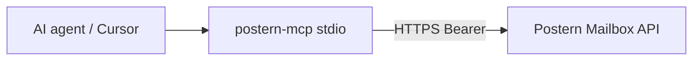

# postern-mcp

[](https://www.npmjs.com/package/@skyphusion/postern-mcp)

A [Model Context Protocol](https://modelcontextprotocol.io) server that exposes the
Postern mailbox to an AI agent. It is a thin, stdio MCP wrapper over the Postern
mailbox API (the same token-gated endpoints the IMAP proxy uses), so an agent can use
the mailbox as a knowledge base and, when explicitly enabled, send mail.

Stack map: [docs/architecture.md](../docs/architecture.md).



- **Read tools** (always on): search, list, read a message, read a thread.
- **Send tools** (v1.1, **opt-in**): `mailbox_send` / `mailbox_reply`, registered
  **only** when a send-scoped token is configured. With a **per-identity** send token
  the worker binds the From to that token's own identity. See
  [Send tools](#send-tools-v11-opt-in) and [Per-identity send](#per-identity-send).

## Tools

### Read (scope `read`)

| Tool | What it does | Wraps |
|---|---|---|
| `mailbox_search` | Search subject + body, newest-first. `mode` defaults to `hybrid` (semantic + keyword). Optional `direction` (`inbound`/`outbound`), `limit`, `cursor`. **The primary tool.** | `GET /api/search` |
| `mailbox_list` | Browse/filter by `to` / `from` / `direction` / `thread`, paginated via `cursor`. | `GET /api/messages` |
| `mailbox_get` | Fetch one full message (headers + body text + attachment metadata) by `message_id`. | `GET /api/messages/{id}` |
| `mailbox_thread` | Fetch every message in a thread by `thread_id`. | `GET /api/threads/{id}` |

### Send (scope `send`, opt-in)

| Tool | What it does | Wraps |
|---|---|---|
| `mailbox_send` | Send a NEW email. Provide `to`, `subject`, and at least one of `text` / `html`. Optional `cc`, `bcc`, `from`, `reply_to`. With a per-identity token the worker stamps `From` to the bound identity; any caller `from` is discarded. | `POST /api/send` |
| `mailbox_reply` | Reply to a stored message by `message_id` (provide `text` and/or `html`). The server fills `to` / `subject` / `In-Reply-To` / `References` / thread, so the reply lands in the same conversation. Optional `cc`, `bcc`, `from`. | `POST /api/reply` |

Send tools are **MUTATING**: they deliver mail. They register only when a send token
is present (see below). The server owns From-enforcement, DKIM signing, threading, and
storing the sent copy; the tools forward a composed message and return the core
`messageId` + `threadId`.

Each tool returns pretty-printed JSON. Errors come back as an MCP `isError` result
with a clear message (never a thrown exception) -- including the worker's own reason
on a 400/401/403 (e.g. `requires send scope`, `invalid to address: ...`).

## Install / build

**From npm** ([@skyphusion/postern-mcp](https://www.npmjs.com/package/@skyphusion/postern-mcp); tag
`postern-mcp-v*` triggers CI publish):

```bash
npx -y @skyphusion/postern-mcp   # requires POSTERN_API_URL + POSTERN_API_TOKEN in env
# or: npm install -g @skyphusion/postern-mcp && postern-mcp
```

**From this repo** (development):

```bash
cd mcp
npm install
npm run build      # compiles src -> dist (tsc)
```

Runtime deps are minimal: the MCP SDK and zod. Node >= 18 (uses the global `fetch`).

### Cursor / Claude MCP config (npm)

```json
{
  "mcpServers": {
    "postern": {
      "command": "npx",
      "args": ["-y", "@skyphusion/postern-mcp"],
      "env": {
        "POSTERN_API_URL": "https://your-postern-api.workers.dev",
        "POSTERN_API_TOKEN": "<read-scoped Postern token>"
      }
    }
  }
}
```

## Configure it in Claude Code

Add an entry to your MCP client config (e.g. `.mcp.json`, or via `claude mcp add`).
Prefer `npx @skyphusion/postern-mcp` from npm (see [Install / build](#install--build)); for local
dev, point at the built `dist/index.js`. Pass the API origin + a **read-scoped** token
in `env` (never put the token in a tracked file):

```json
{
  "mcpServers": {
    "postern": {
      "command": "node",
      "args": ["/absolute/path/to/postern/mcp/dist/index.js"],
      "env": {
        "POSTERN_API_URL": "https://your-postern-api.workers.dev",
        "POSTERN_API_TOKEN": "<read-scoped Postern token>"
      }
    }
  }
}
```

Equivalent CLI form:

```bash
claude mcp add postern \
  --env POSTERN_API_URL=https://your-postern-api.workers.dev \
  --env POSTERN_API_TOKEN=<read-scoped token> \
  -- node /absolute/path/to/postern/mcp/dist/index.js
```

For production, use `"command": "npx", "args": ["-y", "@skyphusion/postern-mcp"]` (see [Cursor / Claude MCP config](#cursor--claude-mcp-config-npm)).

## Configuration

| Env var | Required | Default | Meaning |
|---|---|---|---|
| `POSTERN_API_URL` | yes | -- | the Postern mailbox API origin |
| `POSTERN_API_TOKEN` | yes | -- | a **read-scoped** API token, sent as `Authorization: Bearer` on read tools |
| `POSTERN_SEND_TOKEN` | no | (unset) | a **send-scoped** API token. When set, the send tools register and use it. With a **per-identity** token the worker binds the From to that token's identity. **Mutating; opt-in.** |
| `POSTERN_API_TIMEOUT_MS` | no | `15000` | per-request timeout (ms) |

Every request carries a custom `User-Agent` (`postern-mcp ...`). The API sits behind
Cloudflare, which 403s default bot user-agents ("error 1010"), so this is mandatory.

`stdout` is reserved for the JSON-RPC transport; all server logging goes to `stderr`.

## Send tools (v1.1, opt-in)

Tool registration is **scope-gated** (`src/tools.ts`): each tool declares the scope it
needs and `registerTools` registers only those the configured credentials satisfy.

- Without `POSTERN_SEND_TOKEN`, the server is exactly the v1 read server -- the send
  tools are not registered and an agent cannot see or call them.
- With `POSTERN_SEND_TOKEN` set, the server additionally registers `mailbox_send` and
  `mailbox_reply`, on their own client using the send token. The read tools keep using
  the read token; the send token is never used on read routes.

This mirrors the server-side per-function token split (#85): the worker resolves a
`send`-scoped token to the `send` scope, which returns `200` on `POST /api/send` and
`/api/reply` but `403` on `/api/search` and `/api/admin/*`. So even if a send token
leaked, its blast radius is bounded to sending; it cannot read or administer.

The boot-level gate is proven by `npm run smoke` and documented end to end in
[`PROOF-per-identity-send.md`](PROOF-per-identity-send.md).

## Per-identity send

A send token can be **bound to a single sender identity**, so an agent sends mail **as
itself**, never through a shared god-token. This is the backend per-identity send
registry; the authoritative contract is **[`docs/SEND-IDENTITIES.md`](../docs/SEND-IDENTITIES.md)**.

How it works (the MCP client implements none of it; the worker is authoritative):

- The worker holds one config var `POSTERN_SEND_IDENTITIES` mapping the **sha256 hex
  of a raw send token** to `{ from, displayName? }` (hashes, never raw tokens; it holds
  no credential, so it is a readable var, not a secret -- #335).
- On `POST /api/send` / `/api/reply`, when the presented Bearer resolves to a registry
  entry, the worker **overrides** the outbound `From` to that bound identity and
  discards any caller-supplied `from`. A token cannot send as anyone else. The stored
  outbound row's `from_addr` is that identity (lowercased), threaded and indexed.
- An unknown token is `401`; a send token on a read/admin route is `403`. A registry
  `from` off `ALLOWED_FROM_DOMAIN` fails loud, nothing sent. Full table:
  `docs/SEND-IDENTITIES.md` section 6.

For the agent operator the wiring is unchanged from the section above: put **your own**
per-identity send token in `POSTERN_SEND_TOKEN` (out of band, never in a tracked file),
and the worker binds your From for you. You do not set or send a `from`; it is stamped.

### Rollout: opt-in per identity (deliberate toggle)

Sending is a mutating capability, so it ships **off until a send token is present**.
The read MCP is unchanged for everyone. Enabling send for an agent is a deliberate,
gated step: register the agent's `sha256hex(token) -> { from }` in the worker's
`POSTERN_SEND_IDENTITIES` registry var (no code change; `docs/SEND-IDENTITIES.md` section 7),
hand the agent its **raw** token out of band, and set `POSTERN_SEND_TOKEN` in that
agent's MCP server `env`. Until that toggle is flipped, the send tools do not exist at
runtime. Do not wire a send token into shared/default agent config silently; each
agent gets its own identity-bound token.

## Security

- Tokens are read from the environment only and never logged. Give the server a
  **read** token for read-only use; add a **send** token only to enable sending.
- A leaked token is bounded by its scope: a read token cannot send; a send token
  cannot read or administer (#85). A per-identity send token can only send **as its
  own bound identity** (the worker stamps the From).
- The registry stores token **hashes**, never raw tokens; reading the secret yields no
  usable credential (`docs/SEND-IDENTITIES.md` section 5).
- Do not commit a real token. `.env.example` is a reference only.

## Develop

```bash
npm test         # vitest: client + tools + send + registration units
npm run typecheck
npm run build && npm run smoke   # boots the built server over stdio and asserts the scope gate
```

`npm run smoke` proves the opt-in gate end to end at the process level: a read-only
env exposes exactly the four read tools, and adding `POSTERN_SEND_TOKEN` adds
`mailbox_send` + `mailbox_reply`. Live request scope-gating (a read token gets `403` on
send, a send token `403` on read) and the per-identity From-binding are enforced by the
worker (#85, #138); the end-to-end proof is in
[`PROOF-per-identity-send.md`](PROOF-per-identity-send.md).

## License

MIT (see [LICENSE](LICENSE)). The Postern server core is AGPL-3.0; this client
integration is MIT to maximize reuse, matching the other Postern clients.
