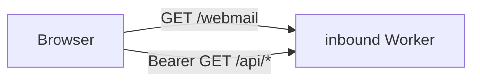

# Postern webmail

A minimal browser frontend for [Postern](../README.md): the human door,
complementing the [IMAP proxy](../imap/README.md). It is a **client of the Postern
API** (`/api/messages`, `/api/messages/{id}`, `/api/threads/{id}`, `/api/search`,
see [`docs/CONTRACT.md`](../docs/CONTRACT.md) section 4) that lets a person browse
and read the one Postern mailbox in a web browser, and **compose and reply** when a
send-scoped token is supplied ([`COMPOSE.md`](COMPOSE.md)).

Stack map: [docs/architecture.md](../docs/architecture.md).



One self-contained `index.html`: vanilla HTML/CSS/JS, **no framework and no build
step**, zero runtime dependencies.

## Screenshots

An HTML email rendered safely in the sandboxed iframe (no scripts, no remote
trackers; author colors on a white background, like any mail client):


The inbox list, a single message (headers, trust verdict, body, attachments), and
the thread view:


Reading a message with an attachment listing, and search:

| Read view | Search |
|---|---|
|  |  |

(Synthetic example data; no real mail.)

The shots are captured against a real local `wrangler dev` instance of the inbound
worker, seeded with the synthetic messages in `inbound/seed.dev.sql` via
`inbound/wrangler.dev.jsonc` (a local D1, no remote bindings). To regenerate:
apply `schema.sql` then `seed.dev.sql` to a local D1, `wrangler dev`, open
`/webmail`, and point it at the dev origin with the dev `POSTERN_API_TOKEN`.

## What it does (v1)

- **Message list** with an Inbox / Sent / All folder filter (the API's
  `direction` filter).
- **Read view** for a single message: headers, trust verdict (spf/dkim/dmarc),
  the body (HTML or plain text, rendered in a sandboxed iframe), and attachments
  with a **Download** button each.
- **Thread view**: sibling messages in the same thread, click to jump.
- **Search** over the mailbox (the `/api/search` endpoint).
- **Compose and reply** when a send-scoped token is configured at connect;
  plain-text bodies. Read-only without one: the compose controls are gated on a
  probed send capability, never on the presence of a token, so a read-only token is
  never offered a UI that can only fail. Full contract: [`COMPOSE.md`](COMPOSE.md).

## Auth (#32): bring your own token

Same bring-your-own-token model as Postern and the IMAP proxy. You supply up to
three things in the browser:

- the **API origin** (e.g. `https://postern.example`),
- your **Postern read token**, and
- optionally a **send-scoped token** to compose and reply ([`COMPOSE.md`](COMPOSE.md)).
  A `send`-scope token gets `403` on every GET, so it cannot stand in for the read
  token; they are separate credentials in separate `sessionStorage` keys.

The token is the `Authorization: Bearer` for the read-API calls. It is kept in
`sessionStorage` for that browser tab **only**: never sent anywhere but the API
origin you name, never written to a cookie, never put in a URL, never logged, and
cleared on **Sign out** or when the tab closes. The page validates the token
against the API before persisting it.

There are **zero skyphusion-specific assumptions**: the API origin is whatever you
type, no account, domain, or resource name is hardcoded.

## Run it

The page is served by the inbound (core) worker at **`/webmail`** on the same
origin as the API, so the page and the API it calls share an origin (no CORS, and
the token stays in one security context):

```
https://<your-postern-origin>/webmail
```

Open that, paste your API origin + token, and connect.

You can also host `webmail/index.html` as a static file anywhere (or open it
locally) and point it at a remote API origin; in that cross-origin case the API
must send permissive CORS headers (the same-origin `/webmail` path needs none).

## Security posture

The token lives in the browser and the page renders stored message content, so
XSS is the main surface. The page is built to neutralize it:

- **No `innerHTML` of message content.** Every message-derived value (subject,
  from/to, body, attachment names, search results) is inserted via DOM **text
  nodes** / `setAttribute`, never parsed as HTML. Stored bytes cannot inject
  markup or script. A test (`inbound/webmail.test.ts`) fails the build if
  `innerHTML =` ever appears in the page.
- **Body in a sandboxed iframe.** The message body is rendered inside an
  `<iframe sandbox="">` (empty sandbox = no scripts, no same-origin, no forms)
  via `srcdoc`, so even a malicious HTML email cannot execute script or reach the
  token / API. When the message has an HTML body (`bodyHtml`) it is rendered
  there; otherwise the plain text is escaped and bare URLs linkified. The
  `<script>`, `onerror`, `onload`, etc. in an HTML body are inert under the
  sandbox.
- **Locked-down CSP** on the served page. The full served policy is:

  ```
  default-src none; style-src unsafe-inline; script-src unsafe-inline;
  connect-src self; img-src self data:; frame-src self;
  base-uri none; form-action none; frame-ancestors none
  ```

  - `connect-src self` is the anti-exfiltration control (a hijacked page cannot
    ship the pasted token to another host); `frame-src self` permits only the
    sandboxed srcdoc body frame; `frame-ancestors none`, plus `nosniff` and
    `no-referrer`.
  - `script-src unsafe-inline` and `style-src unsafe-inline` are present and
    unavoidable: the app is one inline `<script>` and one inline `<style>` (no
    build step, no external assets). Because inline script is allowed, the CSP is
    NOT the top-frame XSS control; the sole top-frame control is the no-`innerHTML`
    discipline (all message-derived content goes through text nodes / `setAttribute`),
    guarded by a test.
  - `img-src self data:` means remote images are **always blocked** on the served
    `/webmail` path. The reading pane is an `about:srcdoc` `sandbox=""` iframe, which
    inherits this policy, so remote subresources cannot load regardless of message
    content. There is no "load remote images" opt-in: a working one would require
    relaxing this directive for the whole top frame, defeating the tracking-pixel
    protection it provides. A per-message notice reports how many remote items were
    blocked; it is informational, not an action (#343).
- **Attachment download via a Bearer fetch.** The API is token-gated, so a
  download fetches the bytes with the `Authorization` header and saves them from
  an object URL; the token is never placed in a URL. The endpoint returns the
  bytes with `Content-Disposition: attachment`, a sanitized filename, and
  `nosniff`, so attachments are never rendered inline.
- The token rides as a header, with `credentials: omit` (no ambient cookies) and
  `referrer-policy: no-referrer`.

These were verified end to end in a headless browser against a real `wrangler dev`
worker: an HTML body carrying `<script>`, ``, `<svg onload>`, and a
`javascript:` link renders its benign markup while NONE of the payloads execute
(the sandbox blocks them, and a click on the `javascript:` link does nothing); the
body iframe is `sandbox=""`; and the attachment download carries the token as a
header (never in the URL).

## Tests

The serving + sync + safety guards live in the inbound worker's vitest suite:

```bash
cd inbound && npm test     # includes webmail.test.ts
```

`webmail.test.ts` asserts: the `/webmail` route serves the HTML (no token
required for the page itself), the health and `/api` token gating are unchanged,
the locked-down CSP/headers are present, the page never uses `innerHTML`, and the
**embedded copy stays byte-identical to `webmail/index.html`** (the worker embeds
the page because it cannot read a file at request time; the source of truth is
`webmail/index.html`).

## Editing

`webmail/index.html` is the canonical, editable source. The worker serves an
embedded copy from `inbound/src/webmail.ts` (no filesystem read at runtime), so
after changing the HTML regenerate the embed:

```bash
cd inbound && npm run sync-webmail
```

`inbound/webmail.test.ts` asserts the embed stays byte-identical to
`webmail/index.html`. The served route at `/webmail` carries the locked-down CSP
and security headers; opening the standalone file directly does not.

## Deferred (follow-ups)

- **Compose extras:** `cc` / `bcc`, attachments, HTML bodies, and drafts. The API
  supports them; the compose UI is plain-text only for now ([`COMPOSE.md`](COMPOSE.md)
  section 4).
- **"Sending as ..." identity display.** The page cannot introspect its own send
  identity (a send token gets `403` on every GET), so it shows no identity rather
  than guessing one; needs a send-scoped echo on the worker side
  ([`COMPOSE.md`](COMPOSE.md) section 3).
- **Keyset pagination polish** (search mode selector shipped in #282).
